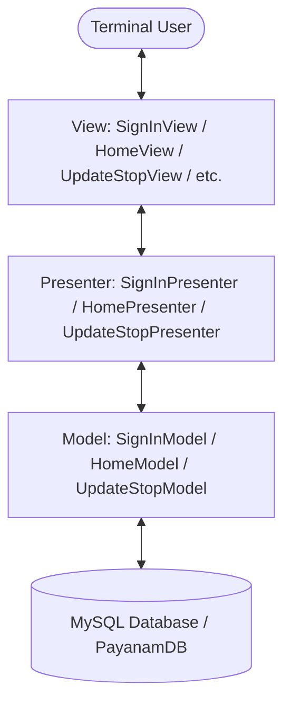
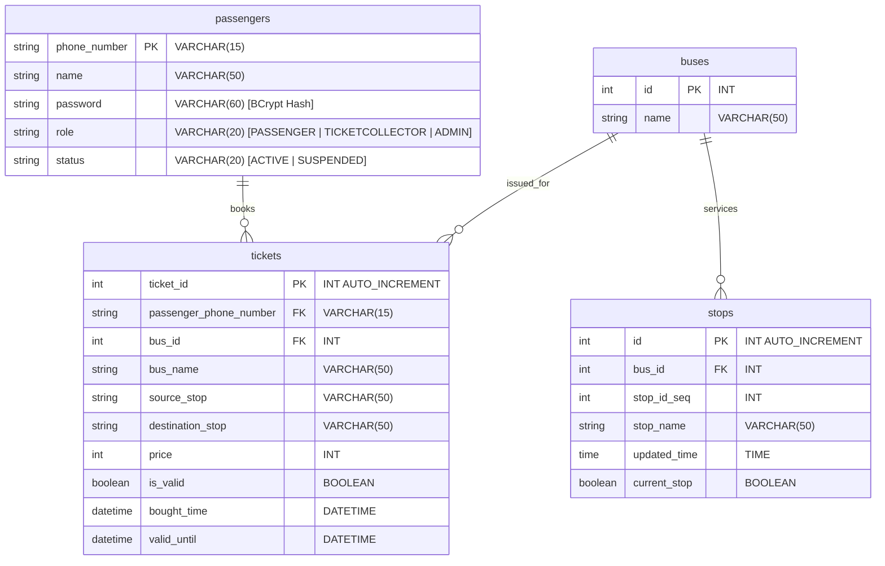

# 🚌 Payanam - Bus Tracking & Ticket Reservation System

[](https://openjdk.org/)
[](https://www.mysql.com/)
[](https://en.wikipedia.org/wiki/BCrypt)
[](https://en.wikipedia.org/wiki/Model%E2%80%93view%E2%80%93presenter)

**Payanam** *(Tamil for "Journey")* is a premium, robust console-based **Bus Tracking & Ticket Reservation System** written in Java 25. The application is built using the **Model-View-Presenter (MVP)** architectural pattern and utilizes a persistent MySQL database layer accessed via JDBC with secure password hashing. 

It provides an interactive interface for passengers to search for buses, book tickets, and view their travel histories, while enabling admins to manage routes/users and ticket collectors to handle ticket validation and real-time bus stop updates.

---

## 🗺️ Table of Contents
1. [Key Features](#-key-features)
2. [Architectural Blueprint](#-architectural-blueprint)
3. [Database Schema](#-database-schema)
4. [Project Structure](#-project-structure)
5. [Prerequisites & Libraries](#-prerequisites--libraries)
6. [Setup & Installation](#%EF%B8%8F-setup--installation)
7. [How to Compile and Run](#-how-to-compile-and-run)
8. [Workflow Showcase](#-workflow-showcase)
9. [Contributors & License](#-contributors--license)

---

## ✨ Key Features

Payanam implements strict role-based access control with distinct operations for each of the three user types:

### 👤 1. Passenger Dashboard
* **Dynamic Bus Search**: Search for buses by their specific number or find all buses passing through a particular stop.
* **Smart Ticket Booking**: Book tickets between any valid source and destination. The system automatically:
  * Prevents booking from stops the bus has already passed.
  * Validates stop sequences (destination must follow source).
  * Calculates fares based on stops traversed.
* **Ticket Management**: View active and expired tickets, complete with validation timestamps and unique Ticket IDs.
* **Profile Management**: View personal account status (Active/Suspended) and information.

### 🎫 2. Ticket Collector Utility
* **Real-Time Stop Tracking**: Allows operators to progress the bus along its route in real time.
  * Start the journey at the first stop.
  * Update current location stop-by-stop.
  * **Dynamic ETA**: Automatically calculates estimated arrival times for upcoming stops based on active travel progression.
  * **Route Reversal**: Upon reaching the terminal stop, reverse the stop hierarchy to start the return journey.
* **Secure Ticket Validation**: Instantly validate passenger tickets by ID. The validator checks if:
  * The ticket exists in the system.
  * The ticket is still valid (not already scanned/used).
  * The ticket has not expired (duration check).
  * Marks successfully validated tickets as **used** in the database.

### 🛡️ 3. Administrator Console
* **Fleet Management**: Add new buses to the system and assign names and identifiers.
* **Route Configuration**: Replace, expand, or clear stop sequences for any bus via simple comma-separated inputs.
* **User & Staff Management**: Add and register new Ticket Collectors, or suspend/delete passengers and staff profiles.

---

## 🏗️ Architectural Blueprint

The project strictly adheres to the **Model-View-Presenter (MVP)** pattern. This ensures complete separation of concerns:
* **Model**: Handles database interaction, data transformation, and business logic execution.
* **View**: Captures user input and renders console frames, menus, tables, and messages.
* **Presenter**: Intermediary that handles action events, triggers validations, communicates with Models, and updates Views.



---

## 🗄️ Database Schema

The database model is structured to maintain absolute integrity with foreign key constraints and cascading deletes.



---

## 📁 Project Structure

```bash
cosole/
├── .vscode/
│   └── settings.json         # VS Code Java 25 workspace runtime settings
├── bin/                      # Compiled class files target directory
├── lib/                      # Bundled external JAR dependencies
│   ├── jbcrypt-0.4.jar       # BCrypt password hashing library
│   └── mysql-connector-j-8.4.0.jar # MySQL JDBC Driver
└── com/
    └── sunilskyros/
        └── payanam/
            ├── Payanam.java   # App entry point (main method)
            ├── data/          # Data Access and Entities
            │   ├── dto/       # Data Transfer Objects (Entities)
            │   │   ├── Bus.java
            │   │   ├── LoginRequest.java
            │   │   ├── Passenger.java
            │   │   ├── Stop.java
            │   │   └── Ticket.java
            │   └── repository/
            │       └── PayanamDB.java # JDBC Connection & Query Handlers
            ├── features/      # MVP Features
            │   ├── homepage/  # Main dashboard feature
            │   │   ├── HomeModel.java
            │   │   ├── HomePresenter.java
            │   │   └── HomeView.java
            │   ├── signin/    # Authentication features
            │   │   ├── SignInModel.java
            │   │   ├── SignInPresenter.java
            │   │   └── SignInView.java
            │   ├── signup/    # Passenger registration
            │   │   ├── SignUpModel.java
            │   │   ├── SignUpPresenter.java
            │   │   └── SignUpView.java
            │   └── ticketcollector/ # Operator specific tools
            │       ├── updatestop/   # Live route tracking
            │       │   ├── UpdateStopModel.java
            │       │   ├── UpdateStopPresenter.java
            │       │   └── UpdateStopView.java
            │       └── validateticket/ # Fare gate validation
            │           ├── ValidateTicketModel.java
            │           ├── ValidateTicketPresenter.java
            │           └── ValidateTicketView.java
            └── util/          # Utility helpers
                ├── DBConnection.java   # Database connection pool manager
                ├── InputAndValidation.java # Mobile & String scanners
                └── PasswordUtil.java   # BCrypt hashing wrappers
```

---

## ⚙️ Prerequisites & Libraries

* **Java Development Kit (JDK)**: Version 25 (or version 21+)
* **Database**: MySQL Server 8.0+ running locally on port `3306`.
* **Libraries** (Bundled in `lib/`):
  * `mysql-connector-j-8.4.0.jar` (MySQL Connection Driver)
  * `jbcrypt-0.4.jar` (BCrypt library)

---

## 🛠️ Setup & Installation

### 1. MySQL Server Configuration
Create a schema named `payanam` in your MySQL database:
```sql
CREATE DATABASE payanam;
```

> [!NOTE]
> The database tables (`passengers`, `buses`, `stops`, and `tickets`) will be **automatically created** on the application's first boot by the self-healing DB schema manager in `PayanamDB.java`. No manual table creation is required!

### 2. Configure Database Credentials
Open `com/sunilskyros/payanam/util/DBConnection.java` and adjust your connection string, username, and password parameters if they differ from the default:
```java
private static final String URL = "jdbc:mysql://localhost:3306/payanam";
private static final String USER = "root";
private static final String PASSWORD = "YourMySQLPassword";
```

### 3. Creating the Seed Administrator Account
By default, you can register as a Passenger using the Sign Up option. To create an administrator account, register normally, then execute the following update query in your SQL terminal to elevate permissions:
```sql
UPDATE passengers SET role = 'ADMIN' WHERE phone_number = 'YOUR_REGISTERED_PHONE_NUMBER';
```

---

## 🚀 How to Compile and Run

Make sure you are in the project's root directory (`cosole/`) before executing the following commands:

### Compile the Code
Create a `bin/` directory and compile all Java source files using the classpath:
```bash
mkdir -p bin
javac -d bin -cp "lib/*" $(find . -name "*.java")
```

### Run the Application
Start the interactive CLI console by launching the main application class:
```bash
java -cp "bin:lib/*" com.sunilskyros.payanam.Payanam
```

---

## 🔄 Workflow Showcase

### 🟢 Passenger Registration Validation
* Mobile numbers must be valid 10-digit Indian formats (starting with `6-9`).
* Passwords must be at least 8 characters long and contain both letters and numbers to satisfy the regex constraints in `InputAndValidation.java`.

### 🚌 Real-time Route Progress (Collector View)
When updating bus stops, the output utilizes visual indicators for journey progress:
* `[ ] Stop Name` - Bus has not arrived/unvisited stop.
* `[->] Stop Name` - Current bus location.
* `[✔] Stop Name [HH:MM AM/PM]` - Visited stop with exact arrival timestamp.

---

## 📄 License

This project is open-source and available under the [MIT License](LICENSE). 

*Safe Travels with Payanam!* 🗺️🚌
